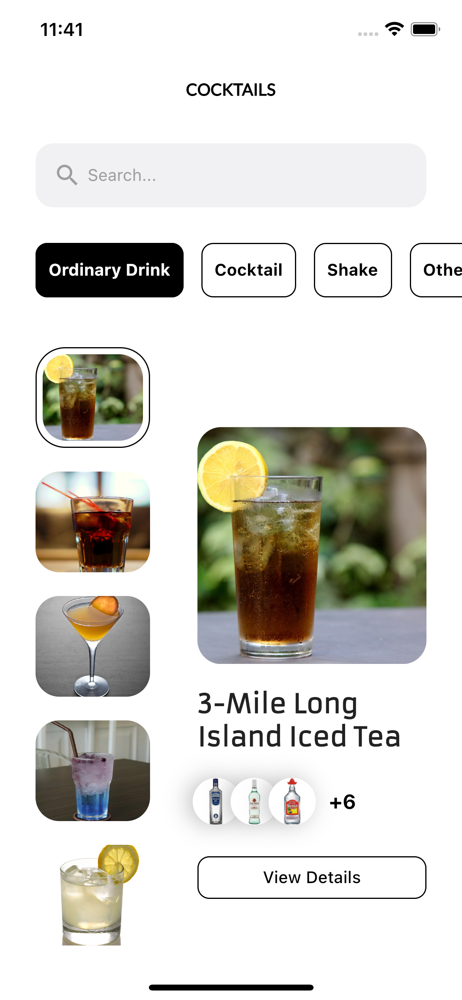
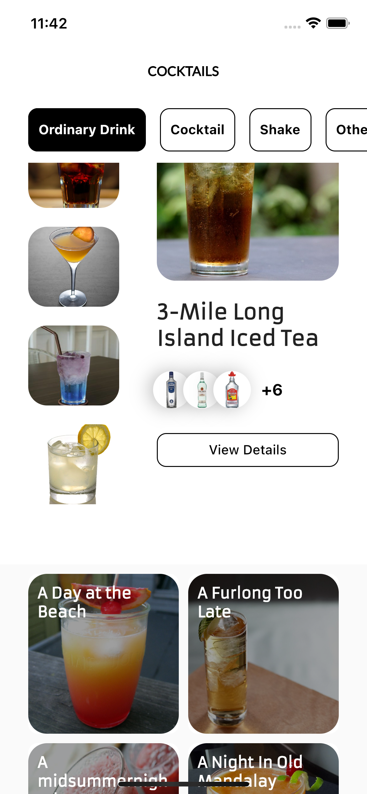
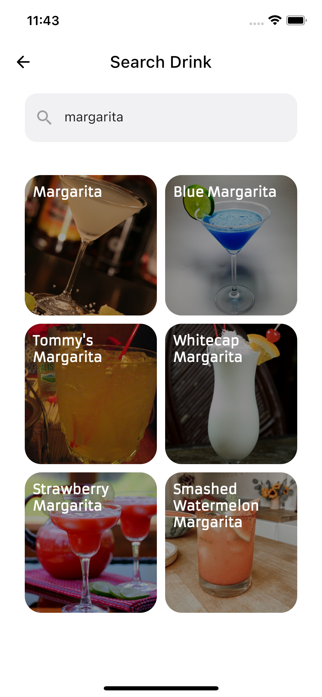
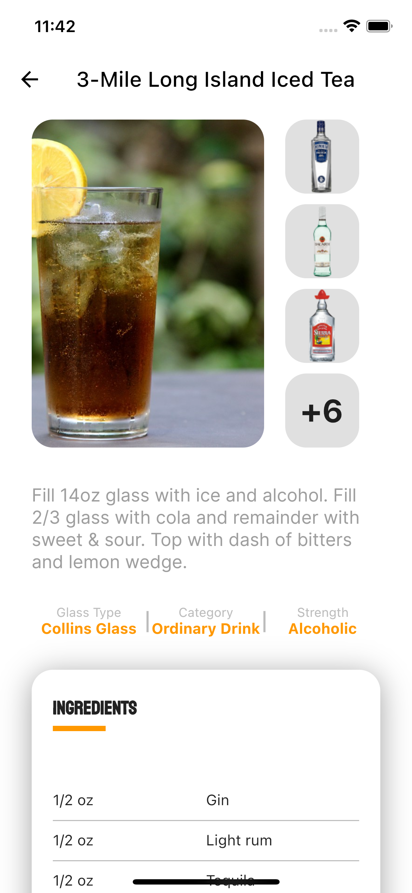
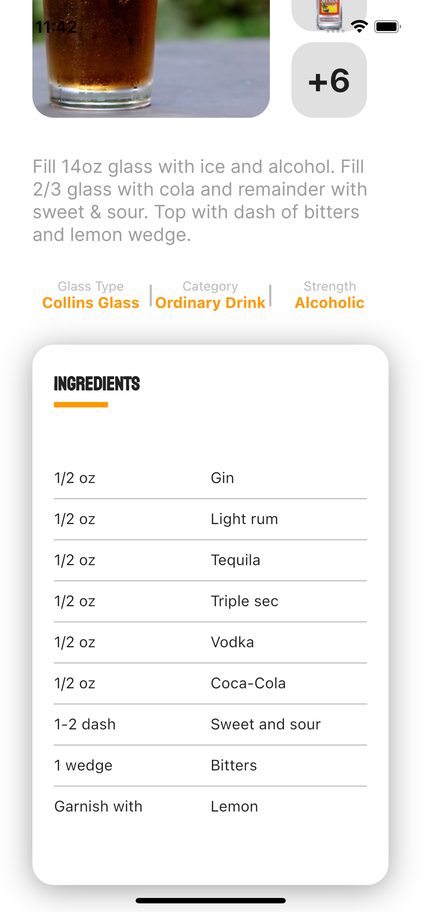

## Cocktail App
## Recipe App

Flutter Bloc Application with Clean Architecture

## Development Setup
Clone the repository and run the following commands:
```
flutter pub get
flutter run
```
## Flutter Version
```
Flutter SDK Version: 3.0.1
```

## Screenshots

### Home Views
 

### Search View


### Drink Detail Views
 

## Api
* [The CocktailDB](https://www.thecocktaildb.com/api.php)
